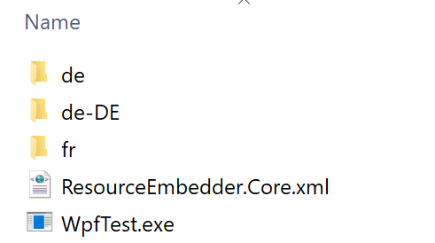
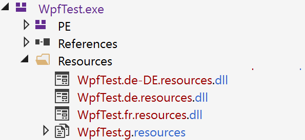

# Automatically embeds satellite assemblies into the main assembly

Compatible with .Net Standard 2.0 and .Net 4.6 and above.

:warning: As of .Net Core 3 single-file publishing exists as an alternative. Where possible consider using it instead of the Resource embedder!

Read [single-file executables](docs/Single%20file%20executables.md) for more details.

## Going forward

Single-file executables technically make the Resource Embedder project obsolete, although there are some use cases (e.g. [manually inject resources](docs/Core%20package%20usage.md)) that aren't (yet) covered natively by .Net Core.

For now no new features are planned for the resource embedder but I will continue to bugfix where the effort is appropriate.

# NuGet references

[Resource.Embedder](https://www.nuget.org/packages/Resource.Embedder/) 

By adding the NuGet package to an assembly all it's satellite assemblies will automatically be embedded as resources and loaded from there.
**Each assembly with localization files needs to reference the embedder package!**

[Resource.Embedder.Core](https://www.nuget.org/packages/Resource.Embedder.Core/) 

Only use the Core package if you want to [manually inject resources](docs/Core%20package%20usage.md)!

## How it works

Before: Localization files (`<Exe name>.resources.dll`) are in seperate folders per language:

After adding the nuget and recompiling: No more seperate files, all localization resources are embedded into exe/dll and are loaded automatically:

## Why?

By embedding localization files it is possible to create "zero dependency" executables that can simply be deployed and "just run".

When using resource embedder also consider using [Costura](https://github.com/Fody/Costura) to embed reference assemblies ([which cannot embed satellite assemblies](https://github.com/Fody/Costura/issues/61) due to the way it's integrated into the build process).

# Links 

* [Known issues](docs/Known%20issues.md)
* [Changelog](docs/Changelog.md)
* [Core package usage](docs/Core%20package%20usage.md)
* [Internals](docs/Internals.md)
* [single file executables in .Net Core 3](docs/Single%20file%20executables.md)

## Verify it works

Once ran, the resource files should disappear from the build output and the Output log will contain messages confirming that the files have been embedded.

The output project will still be properly localized.

Using tools like [dnSpy](https://github.com/0xd4d/dnSpy) it is possible to see that any project using this package contains resources "\<AssemblyName>.\<culture>.resources.dll"

### Configuration

Currently nothing can be configured and it "just works" out of the box.

### Output directory

Note that the satellite assemblies are always copied to the output directory by Visual Studio.

After the build finishes the Resource.Embedder will delete all resource files it has embedded, leaving only the resource files that have not been embedded (if any).

If there are no resource files left for a specific language (empty localization directory) the directory is deleted as well.
